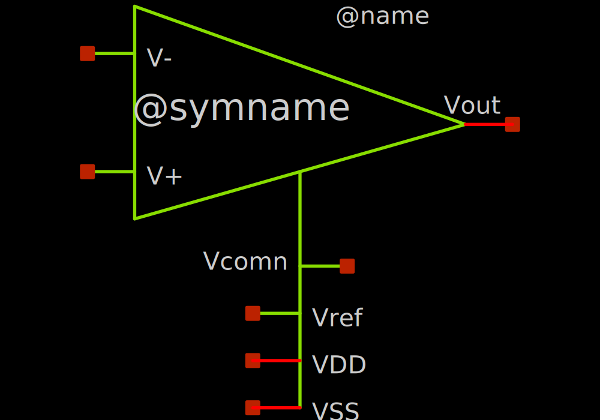
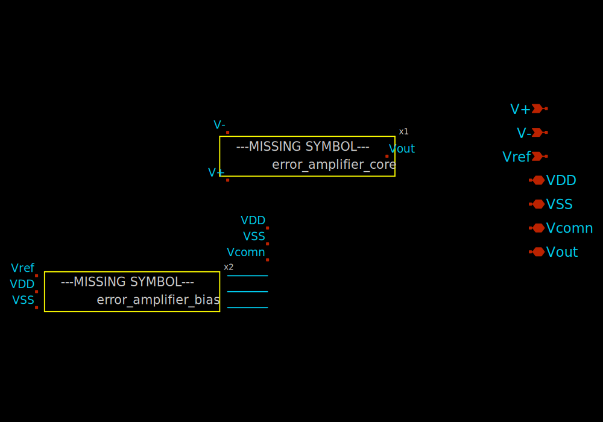

# error_amplifier

- Description: Folded cascode full
- PDK: sky130A

## Authorship

- Designer: Ramon Sarmiento
- Company: OnChip UIS
- Created: May 9, 2025
- License: Apache 2.0
- Last modified: None

## Pins

- VDD
  + Description: Positive analog power supply
  + Type: power
  + Direction: inout
  + Vmin: 1.7
  + Vmax: 1.9
- VSS
  + Description: Analog ground
  + Type: ground
  + Direction: inout
- Vout
  + Description: Output voltage
  + Type: signal
  + Direction: inout
- Vcomn
  + Description: Compensation pin
  + Type: signal
  + Direction: inout
- V+
  + Description: Non inverting input
  + Type: signal
  + Direction: input
- V-
  + Description: Inverting input
  + Type: signal
  + Direction: input

## Default Conditions

- vdd
  + Description: Analog power supply voltage
  + Display: Vdd
  + Unit: V
  + Typical: 1.8
- vref
  + Description: Voltage reference from BandGAP
  + Display: VrefBG
  + Unit: V
  + Typical: 1.2
- corner
  + Description: Process corner
  + Display: Corner
  + Typical: tt
- temperature
  + Description: Ambient temperature
  + Display: Temp
  + Unit: °C
  + Typical: 27

## Symbol

## Schematic

## Layout

